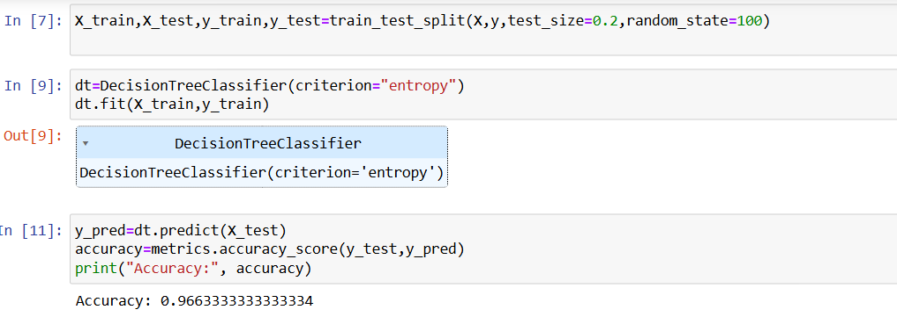

# Implementation-of-Decision-Tree-Classifier-Model-for-Predicting-Employee-Churn

## AIM:
To write a program to implement the Decision Tree Classifier Model for Predicting Employee Churn.

## Equipments Required:
1. Hardware – PCs
2. Anaconda – Python 3.7 Installation / Jupyter notebook

## Algorithm
1. Load the dataset.
2. Preprocess the data(eg., handle categorical variables like salary)
2. Select relevant features and the target variable
3. Split the data into training and testing sets.
4. Train the Decision Tree Classifier on the training data
5. Predict the outcomes using the test data
6. Evaluate the midel's accuracy.
7. Visualize the Decision Tree


## Program:
```
Program to implement the Decision Tree Classifier Model for Predicting Employee Churn.
Developed by: PRAGATHI KUMAR
RegisterNumber:  2122242320200
```
```
import pandas as pd
from sklearn.tree import DecisionTreeClassifier,plot_tree
from sklearn.preprocessing import LabelEncoder
from sklearn.model_selection import train_test_split
from sklearn import metrics
import matplotlib.pyplot as plt
data=pd.read_csv("/content/Employee.csv")
le=LabelEncoder()
data["salary"]=le.fit_transform(data["salary"])
features = ["satisfaction_level", "last_evaluation", "number_project", "average_montly_hours", "salary"]
print(data.columns)
X = data[features]
y = data["left"]
X_train,X_test,y_train,y_test=train_test_split(x,y,test_size=0.2,random_state=100)
dt=DecisionTreeClassifier(criterion="entropy")
dt.fit(x_train,y_train)
y_pred=dt.predict(x_test)
accuracy=metrics.accuracy_score(y_test,y_pred)
print("Accuracy:", accuracy)
plt.figure(figsize=(12,8))
plot_tree(dt,feature_names=features,class_names=["Not Left","Left"],filled=True)
plt.show()
```


## Output:




## Result:
Thus the program to implement the  Decision Tree Classifier Model for Predicting Employee Churn is written and verified using python programming.
